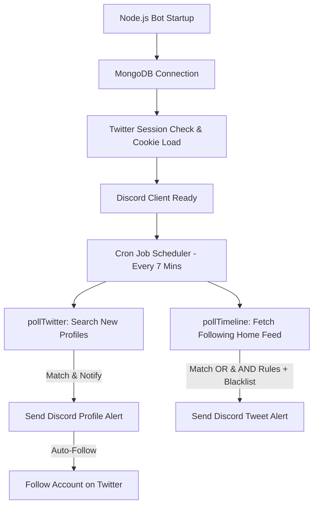

# Discord Twitter Account & Tweet Tracker Bot (ডকুমেন্টেশন)

এটি একটি প্রোডাকশন-রেডি Discord Bot যা টুইটার/X প্রোফাইল এবং টুইট মনিটর করে নির্দিষ্ট কি-ওয়ার্ডের জন্য অ্যালার্ট পাঠায়। এই বটটি অফিসিয়াল টুইটার এপিআই ব্যবহার করে না, বরং স্ক্র্যাপিং-ভিত্তিক `agent-twitter-client` লাইব্রেরি ব্যবহার করে কাজ করে। সেশন ধরে রাখার জন্য প্রথমবার লগইনের পর এটি কুকি (cookies.json) ক্যাশ করে রাখে, যাতে ঘন ঘন পাসওয়ার্ড ব্যবহার করে লগইন করতে না হয়।

---

## 🌟 নতুন ফিচার এবং উন্নয়ন (Updates & Features)

আমরা বটটিকে সম্পূর্ণ **ডায়নামিক (Dynamic)** এবং **স্প্যাম-মুক্ত** করার জন্য কোডে গুরুত্বপূর্ণ কিছু পরিবর্তন করেছি:

1. **ডায়নামিক রুলস ইঞ্জিন (Dynamic Rules Engine):**
   * ব্যবহারকারীরা এখন যেকোনো সময় কোড পরিবর্তন না করেই ডিসকর্ড স্লাশ কমান্ডের মাধ্যমে নতুন নতুন ট্র্যাকিং রুল বা এনএফটি চেইন অ্যাড করতে পারবেন।
   * প্রতিটি রুল স্বতন্ত্র চ্যানেল, নির্দিষ্ট কী-ওয়ার্ড এবং নির্দিষ্ট কনফিগারেশন সাপোর্ট করে।

2. **অ্যান্ড (AND) ও অর (OR) লজিক সাপোর্ট:**
   * **`include_keywords` (`OR` লজিক):** এখানে দেওয়া যেকোনো একটি শব্দ টুইটে থাকলে এটি ম্যাচ করবে।
   * **`required_keywords` (`AND` লজিক):** এখানে দেওয়া প্রতিটি শব্দই টুইটে বাধ্যতামূলকভাবে থাকতে হবে। এই সব কয়টি শব্দ টুইটে না থাকলে এলার্ট যাবে না।
   * বিশেষ প্রতীক যেমন `$SOL`, `@solana`, `#NFT` ইত্যাদি এখন কোনো সমস্যা ছাড়াই নিখুঁতভাবে ডিটেক্ট হবে।

3. **শুধুমাত্র অনুসরণ করা অ্যাকাউন্ট মনিটর (Following-Only Timeline Polling):**
   * মেমেকয়েন স্ক্যাম এবং অপ্রাসঙ্গিক স্প্যাম পোস্ট ঠেকাতে গ্লোবাল সার্চ সম্পূর্ণ বন্ধ করে দেওয়া হয়েছে।
   * বটটি এখন শুধুমাত্র আপনার বটের টুইটার অ্যাকাউন্ট যাদের ফলো করে (Following list), তাদের হোম টাইমলাইনের সর্বশেষ ৮০টি টুইট ট্র্যাক করবে।

4. **অটো-ফলো (Auto-Follow Discovered Accounts):**
   * প্রোফাইল ফাইন্ডার যখনই কোনো নতুন আর্লি প্রোফাইল খুঁজে পাবে এবং অ্যালার্ট পাঠাবে, সাথে সাথে বটটি স্বয়ংক্রিয়ভাবে টুইটারে সেই অ্যাকাউন্টটিকে ফলো করে নেবে। এর ফলে তার পরবর্তী টুইটগুলো বট স্বয়ংক্রিয়ভাবে টাইমলাইনে মনিটর করতে পারবে।

5. **এনএফটি-অনলি গিভঅ্যাওয়ে ফিল্টার (NFT-Only Giveaway Filter):**
   * গিভঅ্যাওয়ে চ্যানেলে টোকেন/কয়েনের স্প্যামিং ঠেকাতে আমরা কঠোর এনএফটি-অনলি ফিল্টার যোগ করেছি। 
   * টুইটটিতে গিভঅ্যাওয়ে ইন্ডিকেটর (যেমন: `giveaway`, `FCFS`, `follow`, `drop address`, `rt`, `retweet`, `GTD` বা `10xgtd`) থাকার পাশাপাশি অবশ্যই এনএফটি শব্দ (যেমন: `nft`, `pfp`, `mint`, `wl`, `whitelist`, `collection` ইত্যাদি) থাকতে হবে।

6. **স্প্যাম এবং টোকেন পাম্প ব্ল্যাকলিস্ট:**
   * মেমেকয়েন লিকুইডিটি এবং পাম্প অ্যান্ড ডাম্প স্ক্যানারগুলোর স্প্যাম পোস্ট ঠেকাতে আমরা শক্তিশালী ব্ল্যাকলিস্ট প্যাটার্ন যুক্ত করেছি। যেমন: `MC: $`, `FDV: $`, `Liq: $`, `Vol 1h`, `DEX: pumpswap`, `pump.fun`, `Buy/Sell Ratio`, এবং কন্টাক্ট অ্যাড্রেস (CA) যুক্ত পোস্টগুলো সম্পূর্ণ ফিল্টার হয়ে যাবে।

7. **অ্যাকাউন্টের বয়স লিমিট বৃদ্ধি (Default 96 Hours):**
   * নতুন প্রোফাইল ডিটেক্ট করার জন্য বয়সের সীমা বাড়িয়ে **৯৬ ঘণ্টা বা ৪ দিন** করা হয়েছে।

---

## 🏗️ বটের গঠন ও কাজের প্রবাহ (Bot Architecture & Flow)

বটটির ব্যাকএন্ড স্ট্রাকচার ৪টি মূল স্তরে কাজ করে:



### ১. স্টার্টআপ এবং ডাটাবেজ সংযোগ (Startup & DB Sync)
বটটি চালু হওয়ার সাথে সাথে MongoDB ডাটাবেজের সাথে সংযোগ স্থাপন করে। `GuildConfig` কালেকশন থেকে ডিসকর্ড সার্ভারের বর্তমান চ্যানেল, সেটিংস এবং ট্র্যাকিং রুলগুলো লোড করা হয়। ডাটাবেজে রুলস না থাকলে এটি স্বয়ংক্রিয়ভাবে ডিফল্ট তিনটি রুলস তৈরি করে।

### ২. টুইটার কুকি ও সেশন ভ্যালিডেশন (Twitter Session Cache)
লগইন সিকিউরিটির জন্য বটটি প্রথমে লোকাল `cookies.json` ফাইল চেক করে। ফাইলটি থাকলে পাসওয়ার্ড ইনপুট না দিয়েই সরাসরি সেশন সচল করে। নতুন অ্যাকাউন্ট বা সেশন শেষ হলে এটি ক্রেনডেশিয়াল ব্যবহার করে নতুন কুকি জেনারেট করে এবং ফাইলে সেভ করে।

### ৩. পোলিং এবং ট্র্যাকিং সাইকেল (Polling Cycles)
বটের মূল কাজ দুটি ব্যাকগ্রাউন্ড সাইকেলে বিভক্ত যা প্রতি ৭ মিনিট পরপর রান করে:
* **প্রোফাইল মনিটর (`pollTwitter`):** সেট করা কী-ওয়ার্ডগুলোর উপর ভিত্তি করে টুইটার সার্চ করে নতুন ও সক্রিয় ক্রিপ্টো/এনএফটি প্রোফাইল সনাক্ত করে। প্রোফাইলের বয়স ৪ দিনের কম হলে ডিসকর্ডে অ্যালার্ট পাঠায় এবং প্রজেক্টের পেছনে সরাসরি টুইটারে ফলো করে নেয়।
* **টুইট মনিটর (`pollTimeline`):** বটের টুইটার অ্যাকাউন্টের হোম ফিড থেকে ফলো করা ব্যবহারকারীদের সর্বশেষ ৮০টি টুইট সংগ্রহ করে। এরপর প্রত্যেকটি টুইটকে আপনার সেট করা ডায়নামিক রুলস (যেমন Solana NFT, Robinhood WL, Giveaways) এবং ব্ল্যাকলিস্ট প্যাটার্নের মাধ্যমে যাচাই করে নির্দিষ্ট Discord চ্যানেলে Rich Embed এলার্ট আকারে পোস্ট করে।

### ৪. ডিসকর্ড ইন্টারঅ্যাকশন (Discord Interactions)
ব্যবহারকারী যখন ডিসকর্ডে কোনো স্লাশ কমান্ড রান করেন, বটটি তা রিসিভ করে ডাটাবেজে আপডেট করে দেয়। এর ফলে পোলিং সিস্টেম তাৎক্ষণিকভাবে নতুন ডাটা অনুযায়ী সার্চ করতে শুরু করে।

---

## 🛠️ প্রোজেক্টের ফাইল স্ট্রাকচার (Project Structure)

* **`db.js` (ডাটাবেজ কনফিগারেশন):**
  * `MonitorRuleSchema` যুক্ত করা হয়েছে যা প্রতিটি ডিসকর্ড সার্ভারের রুলসগুলো সংরক্ষণ করে।
  * এটি রুলের নাম, টার্গেট চ্যানেল আইডি, অথর কী-ওয়ার্ড, ইনক্লুড কী-ওয়ার্ড, রিকোয়ার্ড কী-ওয়ার্ড এবং এটি গিভঅ্যাওয়ে ট্র্যাকার কিনা তা ট্র্যাকিং করে।
* **`deploy-commands.js` (স্লাশ কমান্ডস ডেপ্লয়মেন্ট):**
  * ডিসকর্ডে নতুন স্লাশ কমান্ডগুলো গ্লোবালি রেজিস্টার করার স্ক্রিপ্ট।
* **`index.js` (প্রধান লজিক ফাইল):**
  * ডিসকর্ড ক্লায়েন্ট ইভেন্ট হ্যান্ডল করে।
  * ক্লায়েন্ট তৈরি হওয়ার সাথে সাথে ডাটাবেজে আপনার ৩টি ডিফল্ট চ্যানেল রুলস আপডেট বা সেট করে দেয়।
  * `pollTimeline()` প্রতি ৭ মিনিট পর পর টুইটার হোম টাইমলাইন স্ক্র্যাপ করে ডাইনামিক রুলস ও লেগাসি কী-ওয়ার্ডের অ্যান্ড/অর লজিক অনুযায়ী ফিল্টার করে সঠিক চ্যানেলে প্রিমিয়াম এমবেড মেসেজ পাঠায়।
* **`deploy.js` (VPS ডেপ্লয়মেন্ট স্ক্রিপ্ট):**
  * এটি আপনার VPS সার্ভারে লোকাল ফাইলগুলো SSH এর মাধ্যমে আপলোড করে ডিপেন্ডেন্সি ইনস্টল করে এবং PM2 দিয়ে প্রসেসটি সচল করে।

---

## 💻 ডিসকর্ড স্লাশ কমান্ডসমূহ (Slash Commands)

### ডায়নামিক রুলস ইঞ্জিন কমান্ডস (Dynamic Rules):
* **`/addrule`**: নতুন কোনো প্রজেক্ট বা ট্র্যাকিং রুল যোগ করতে এটি ব্যবহার করবেন।
  * `channel` (বাধ্যতামূলক): যে চ্যানেলে নোটিফিকেশন যাবে।
  * `name` (বাধ্যতামূলক): রুলের নাম (যেমন: `monad-hype`)।
  * `author_keywords` (ঐচ্ছিক): টুইটার অ্যাকাউন্ট নেম বা ডিসপ্লে নেম ফিল্টার।
  * `include_keywords` (ঐচ্ছিক): টুইটে যেসব শব্দগুলোর যেকোনো একটি থাকতে হবে (`OR` লজিক)।
  * `required_keywords` (ঐচ্ছিক): টুইটে যেসব শব্দগুলোর প্রতিটিই থাকতে হবে (`AND` লজিক)।
  * `is_giveaway` (ঐচ্ছিক): এটি একটিভ গিভঅ্যাওয়ে এলার্ট চ্যানেল কিনা (True/False)।
* **`/removerule`**: রুলটির নাম দিয়ে খুব সহজেই ট্র্যাকিং বন্ধ করতে পারবেন।
* **`/listrules`**: সার্ভারে বর্তমানে কোন কোন রুল ও কী-ওয়ার্ড অ্যাক্টিভ আছে তার তালিকা দেখতে পারবেন।

### সাধারণ সেটিংস কমান্ডস (Legacy & Mode):
* **`/setchannel <channel>`** - প্রোফাইল ট্র্যাকার অ্যালার্ট চ্যানেল সেট করার জন্য।
* **`/setkeyword <word>`** - প্রোফাইল ট্র্যাকার কী-ওয়ার্ড যুক্ত করার জন্য।
* **`/removekeyword <word>`** - প্রোফাইল ট্র্যাকার কী-ওয়ার্ড বন্ধ করার জন্য।
* **`/listkeywords`** - প্রোফাইল ট্র্যাকারের কী-ওয়ার্ডের তালিকা দেখতে।
* **`/setmode <new-only|all-matches>`** - প্রোফাইল ট্র্যাকিং মোড সেট করতে (৯৬ ঘণ্টার নিচের নতুন অ্যাকাউন্ট নাকি সব অ্যাকাউন্ট)।
* **`/checkprofile <username>`** - যেকোনো টুইটার অ্যাকাউন্টের বিস্তারিত তথ্য এবং বয়স (Account Age in Days) জানার জন্য।

---

## 🚀 ইনস্টলেশন ও রান করার নিয়ম (Installation & Setup)

### ১. ডিপেন্ডেন্সি ইনস্টল করা
```bash
npm install
```

### ২. এনভায়রনমেন্ট কনফিগার করা
আপনার প্রজেক্ট ডিরেক্টরিতে একটি `.env` ফাইল তৈরি করুন এবং নিচের মানগুলো বসান:
```env
DISCORD_TOKEN=your_discord_bot_token
CLIENT_ID=your_discord_bot_client_id
MONGO_URI=your_mongodb_connection_string
TW_USER=your_twitter_username
TW_PASS=your_twitter_password
TW_EMAIL=your_twitter_email
POLL_INTERVAL_CRON=*/7 * * * *
NEW_ACCOUNT_HOURS=96
```

### ৩. স্লাশ কমান্ড ডেপ্লয় করা
```bash
npm run deploy-commands
```

### ৪. লোকাল রান
```bash
npm start
```

---

## ☁️ VPS-এ ডেপ্লয় করার নিয়ম (Production Deployment)

আপনার প্রজেক্টের লোকাল আপডেটগুলো সরাসরি VPS-এ ডেপ্লয় করা অত্যন্ত সহজ। আপনার প্রজেক্ট ডিরেক্টরিতে deploy.js ফাইলটি কনফিগার করা আছে।

লোকাল টার্মিনাল বা কমান্ড লাইনে নিচের কমান্ডটি রান করলেই লোকাল ফাইলগুলো SSH-এর মাধ্যমে আপনার VPS-এ আপলোড হবে, সেখানে npm install হবে এবং PM2 প্রসেস ম্যানেজার দিয়ে বটটি চালু বা রিস্টার্ট হবে:

```bash
node deploy.js
```
*(এটি সফলভাবে সম্পন্ন হলে টার্মিনালে DEPLOYMENT COMPLETE! বার্তাটি দেখতে পাবেন)*

---

## 🏆 Twitter Giveaway Picker & Winner Slip Generator (ওয়েব টুল)

বটের পাশাপাশি আমরা একটি স্টাইলিশ ওয়েব-ভিত্তিক **Twitter Giveaway Picker** যুক্ত করেছি। এর মাধ্যমে আপনি সহজেই যেকোনো টুইটার গিভঅ্যাওয়ের বিজয়ী নির্বাচন করতে পারবেন এবং ডাউনলোডের জন্য একটি ভেরিফাইড স্লিপ জেনারেট করতে পারবেন।

### ফিচারের সুবিধাসমূহ:
১. **সুইটেবল ইন্টারফেস:** গ্লাস-মরফিজম (Glassmorphism) ডিজাইনের প্রিমিয়াম ডার্ক-মোড প্যানেল।
২. **ফিল্টার কনফিগারেশন:** 
   * **Twitter Post Link:** পোস্টের ইউআরএল ভেরিফিকেশন।
   * **Must Follow:** বিজয়ীকে নির্দিষ্ট হ্যান্ডেল ফলো করতে হবে কিনা তা চেক করা (কমা দিয়ে একাধিক হ্যান্ডেল যুক্ত করা যাবে)।
   * **Min Followers / Min Account Age:** ন্যূনতম ফলোয়ার সংখ্যা ও কতদিন পুরনো অ্যাকাউন্ট হতে হবে তার স্লাইডার ফিল্টার।
   * **Must Like / Must Retweet:** লাইক বা রিটুইট আবশ্যিক কিনা তা সেট করা।
   * **Custom / Pasted Replies (ঐচ্ছিক):** আপনি চাইলে নিজে কোনো হ্যান্ডেল লিস্ট পেস্ট করতে পারেন অথবা অটো-সিমুলেটর দিয়ে ডেমো ট্রায়াল নিতে পারেন।
৩. **প্রিমিয়াম লটারি অ্যানিমেশন:** স্লট-মেশিনের মতো দ্রুত স্ক্রলিং ইফেক্ট এবং চমৎকার অডিও সাউন্ড টিক।
৪. **ভেরিফাইড স্লিপ ডাউনলোড:** 
   * বিজয়ী সিলেক্ট হওয়ার সাথে সাথে ব্যাকগ্রাউন্ডে একটি ইউনিক **Verified Chess DAO** স্লিপ (সার্টিফিকেট) তৈরি হবে।
   * এই স্লিপে বিজয়ীর ছবি, ফলোয়ার সংখ্যা, অ্যাকাউন্ট বয়স, একটি ইউনিক সিরিয়াল নম্বর, ভেরিফিকেশন হ্যাশ কোড এবং একটি অত্যন্ত সুন্দর **Chess DAO অফিশিয়াল গোল্ডেন সিল (Seal) ও মোহর** থাকবে।
   * **Download Slip (PNG)** বাটনে ক্লিক করে এটি সরাসরি হাই-রেজোলিউশন ইমেজ আকারে সেভ করতে পারবেন।

### কিভাবে রান করবেন:
১. প্রজেক্টের `picker` ফোল্ডারে প্রবেশ করুন।
২. সরাসরি `index.html` ফাইলটি যেকোনো ব্রাউজারে ডাবল-ক্লিক করে ওপেন করুন। অথবা লোকাল সার্ভারে চালাতে চাইলে:
   ```bash
   npx serve picker
   ```
৩. কনফিগারেশন সেট করুন এবং **Draw Winner** বাটনে ক্লিক করুন!

